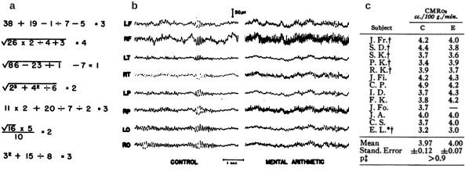

[//]: # %% optional title: Dynamic remodelling of neural activity as a working principle of brain function %%

[//]: # %% notes on references below: %%
[//]: # %% Edelman: degeneracy/redundancy, Faisal: noise, Brette: coding %%
[//]: #  NEED TO IMPROVE REFERENCES BELOW

Many aspects of brain function challenge the intuition of efficient information processing inherited from engineering and computer science
([Edelman & Gally, 2001](Edelman2001.pdf); [Faisal et al., 2008](Faisal2008.pdf); [Sterling & Laughlin, 2015](Sterling2015.pdf); [Aimone & Parekh, 2023](Aimone2023.pdf); [Brette, 2026](Brette2026.pdf)).
Notably, the energetic perspective is likely the most striking feature of such counter-intuitive aspects.

%%beginFigure%%
   
**Effect of mental effort on neural activity and cerebral oxygen consumption.** 
(a) Example arithmetic problems used to induce mental effort.
(b) Example electroencephalographic (EEG) activity patterns in control and mental arithmetic conditions.
(c) Measurements of Cerebral Metabolic Rate for Oxygen consumption ($\textnormal{CMR}_{O^2}$) in control (C) and mental effort (E) conditions across 13 subjects. Note the lack of significant changes between the two conditions.
Reproduced from [Sokoloff et al., 1955](Sokoloff1955.pdf).  
%%endFigure%%

In the early years of modern neuroscientific research, puzzling observations sarted to challenge our intuition.
In 1955, a study by [Sokoloff and colleagues](Sokoloff1955.pdf) aimed at measuring oxygen consumption during sustained mental effort. 
A natural hypothesis was that such effort would require more energy and thus increase oxygen consumption. 
In their study, mental effort was induced by asking participants to answer non-trivial arithmetic problems (see [Fig.a](../Figures/Sokoloff-1955.svg)).
Clearly, this task was induced modulations of brain activity associated with high cognitive loads (see [Fig.b](../Figures/Sokoloff-1955.svg), note the increase of high-frequency activity in electro-encephalogram patterns). 
In parallel, they estimated blood flow and oxygen consumption by collecting simultaneous samples of both arterial and venous blood and by leveraging the previously-introduced nitrous oxide method ([Kety & Schmidt, 1948](Kety1948.pdf)).
Against their expectation, they could not find a significant difference in energy consumption between control and mental effort conditions (see [Fig.c](../Figures/Sokoloff-1955.svg)). 
Therefore, despite clear changes in neural activity patterns, no significant changes in cerebral oxygen consumption could be observed during mental effort ([Sokoloff et al., 1955](Sokoloff1955.pdf)).

\begin{comment}  
 %% I am writing an essay in computational neuroscience. I introduce the specificity of the brain's computation by taking the energetic perspective. I want to say that it runs on an approximately constant energy consumption level. To initially support this claim, I am taking the example of the 1955 study by Sokoloff and colleagues, that reported non-significant changes in oxygen consumption during mental effort. Now, I want to find a statement that states that despite the limitations of this measurement (and briefly list those limitations), it still allowed to highlight the core principle at work: the constant energy consumption. Ideally, this statement should also state the refinement that have been brought to this picture (e.g. non-oxidative processes contributing, the oxygen consumption estimates of fMRI, ...) %%   
\end{comment}

This early study by Sokoloff and colleagues had several limitations. Notably, it measured only a _global_, whole-brain arteriovenous oxygen difference (it could not resolve regional changes), at a single time point, in a small cohort and it captured strictly _oxidative_ processes\footnote{
This picture has since been importantly refined. 
Three decades later, PET studies by Fox and Raichle (1986; 1988; reviewed in Fox and Raichle, 2007) showed that at the regional level, focal neural activation does produce a measurable rise in oxygen consumption,  but one far smaller ($\sim5\%$) than the accompanying rises in cerebral blood flow (CBF) and glucose use ($\sim50\%$), revealing that much of the acute energetic response is met by non-oxidative (aerobic) glycolysis rather than oxidative phosphorylation. 
This same CBF/CMR$_{O^2}$ modulation is what BOLD fMRI exploits as its physiological basis, and calibrated fMRI approaches now allow this small residual CMR$_{O^2}$ change to be estimated quantitatively at the regional level. 
}.   
However, despite these limitations, the finding identified a core organizational principle of cortical energy use: the brain's total energy budget is dominated by an important, largely fixed baseline cost, against which any task-evoked increment is marginal. Later research established the biophysical underpinning behind this principle (see [Attwell & Laughlin, 2001](Attwell2001.pdf); [Sterling & Laughlin, 2015](Sterling2015.pdf)).

\begin{comment}
%% To connect to my ANN comparison. Can you now build a paragraph that would state what would be the energy cost of solving the task of the Sokoloff et al. study (mental arithmetic problems shown to the participants) by an ANN. Specify the image recognition of the problem. Then the digital computations. highlight the high signal-to-noise ratio strategy and its high energy cost. %%  
\end{comment}

On the other hand, reproducing the same task with a modern artificial intelligence system (derived from engineering and computer science) leads to a very different picture. 
The task would be divided into two sub-problems. 
First a perceptual problem: recognizing the digits and operators presented to the participant. 
Nowadays, this can be solved with a deep vision network (a CNN or a vision transformer).
The second sub-problem, the arithmetic itself once the operands are extracted, is computationally trivial: a handful of machine instructions executed by deterministic digital logic.
The first task will thus dominate the energy budget in this task. 
Considering very rough estimates, a frontier vision CNN running on Graphical Processing Units (GPUs) requires a power of around $\sim10000$ Watts\footnote{e.g. the DGX H100 from Nvidia, see https://docs.nvidia.com/dgx/dgxh100-user-guide/}.
This strongly contrasts with the human brain, that is though to run at approximately $\sim12$ Watts ([Sterling & Laughlin, 2015](Sterling2015.pdf)).

This asymmetry reflects a general property of digital hardware: reliability is bought by operating at a very high signal-to-noise ratio at every processing stage — large voltage swings, high-precision arithmetic units, and heavily over-parameterized networks trained to be robust to input variability ([Sarpeshkar, 1998](Sarpeshkar1998.pdf)).
This strategy guarantees near-zero error propagation across computational stages, but at an energetic cost orders of magnitude above the information-theoretic content of the problem being solved. 

The overwhelming majority of the artificial system's energy budget for this task is therefore spent not on "computing" in any meaningful sense, but on perception — on reliably converting a noisy visual signal into an error-free digital token. 

The brain, faced with the identical task, uses the opposite strategy: individual synapses and spikes are themselves highly unreliable, low-signal-to-noise devices, and reliability is instead achieved statistically, through redundancy and population averaging rather than through high per-unit fidelity. 

This is precisely why the arithmetic task Sokoloff and colleagues' participants performed — visual recognition and manipulation of digits together — could be carried out without measurably shifting global oxygen consumption: the brain's low-SNR, massively parallel computational substrate solves the same problem the ANN pipeline solves, but does so as a marginal increment on an already-large baseline, rather than as a large energetic event in its own right.

*This comparison therefore tells a *

The 
My research aims at understandin

Recent years have seen a tremendous development of Artificial Intelligence (AI) systems and thus offer a interesting viewpoint to compare with the processing unit we're most familiar with: the brain.

AI is catching up on many aspects of human cognition, such as ..., but there is one aspect where it is not. Energy. It’s even getting worse and worse.

Considering very rough estimates, a frontier Large Language Model (LLM) answering to a complex request will rely on the usage of multiple Graphical Processing Units (GPUs) running at a total power of around 10.000 Watts\footnote{e.g. the DGX H100 from Nvidia, see https://docs.nvidia.com/dgx/dgxh100-user-guide/}.
In contrast, the brain runs at approximately ~12 Watts ([Sterling & Laughlin, 2015](Sterling2015.pdf)).

This number tells us how far we are from understanding the brain.

Overall, the design behind modern Artificial Intelligence (AI) systems nicely illustrate how *"we"* conceive an efficient information processing system. The core principle is a high Signal-to-Noise (SNR) system working on very high-dimensional data.

| quantity | AI Systems         | Brain    |
| -------- | ------------------ | -------- |
| voltage  | 0.5-1volt          |          |
| currents | micro- to milliamp | picoamps |
|          |                    |          |

On the other hand, the brain 

Unfair comparison. 100 years of computer science Vs billions of years of evolution

AI is rapidly catching up with, and in some cases surpassing, human cognitive performance on a growing number of benchmarks, such as [...]. Yet there is one dimension along which the gap is not closing, but widening: energy. By even rough estimates, a frontier Large Language Model (LLM) answering a complex query draws on multiple Graphics Processing Units (GPUs), together consuming on the order of 10,000 Watts\footnote{e.g., the NVIDIA DGX H100, rated at up to 10.2 kW under peak load; see NVIDIA, 2024.}. The human brain, by contrast, operates on a budget of roughly 20 Watts (Attwell & Laughlin, 2001; Sokoloff et al., 1955).

This three-orders-of-magnitude gap is a sobering reminder of how far we remain from understanding — let alone replicating — the brain's computational efficiency.

More broadly, the design choices underlying modern AI systems offer a revealing mirror of how "we" conceive of an efficient information-processing system: largely as a high-Signal-to-Noise-Ratio (SNR) architecture operating on very high-dimensional data.

My past research has focused on explaining the 

I show in [Fig.](../Figures/intra-in-vivo.svg) the membrane (see also [Poulet & Petersen, 2010](Poulet2010.pdf)).
[Zerlaut et al., 2019](Zerlaut2019.pdf)

%%beginFigure%%
   
**Neural activity from the single neuron perspective.**
Membrane potential dynamics of a single pyramidal neuron in the mouse somato-sensory cortex during wakefulness. Whole-cell patch-clamp intracellular recording in the supragranular layer of the primary somatosensory cortex. 
Data from [Zerlaut et al., 2019](Zerlaut2019.pdf).
%%endFigure%%

From this ...

