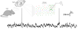
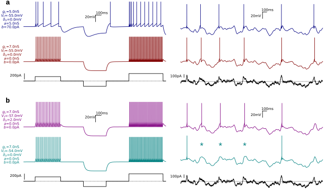

# Role of Cellular & Synaptic Mechanisms under _in vivo_-like Activity 

%%beginFigure%%
 
**| Membrane potential dynamics of a single pyramidal neuron during wakefulness.**
Whole-cell patch-clamp intracellular recording in the supragranular layer of the mouse primary somatosensory cortex. 
Data from [Zerlaut et al., 2019](Zerlaut2019.pdf).
%%endFigure%%

An important focus of my early research work has been to evaluate the contribution of cellular and synaptic mechanisms in shaping single cell integration in the context of *in vivo-like* activity.

I show in [Fig.](../Figures/intra-in-vivo.svg) the membrane potential fluctuations of a pyramidal neuron in the mouse primary sensory cortex (S1) in awake mice (see also [Crochet & Petersen, 2006](Crochet2006.pdf); [Poulet & Petersen, 2008](Poulet2008.pdf); [Niell & Stryker, 2010](Niell2010.pdf)).

It is striking that endogenous dynamics _in vivo_ is characterised by a strong level of ongoing, seemingly stochastic, synaptic activity ([Destexhe et al., 2003](Destexhe2003.pdf)).
The activity is characterised by strong subthreshold fluctuations and irregular firing at low rate: this constitutes the **_fluctuation-driven regime_**, which is believed to be central to cortical computations ([Destexhe & Contreras, 2006](Destexhe2006.pdf)).
This dynamical regime has been shown to emerge from a dynamic balance between recurrent excitatory and inhibitory synaptic activity within cortical networks ([van Vreeswijk & Sompolinsky, 1996](VanVreeswijk1996.pdf); [Destexhe & Paré, 1998](Destexhe1998.pdf); [Paré et al., 1998](Pare1998b.pdf); [Shu et al., 2003](Shu2003.pdf); [Haider et al., 2006](Haider2006.pdf); [Okun & Lampl, 2008](Okun2008.pdf); [Renart et al., 2010](Renart2010.pdf)).

Now, such a particular regime will impose *very specific constraints* on the way the synaptic and cellular mechanisms are engaged in neural networks _in vivo_.

Classically, single cell responses are classified using their firing profile in response to a current step ([Connors & Gutnick, 1990](Connors1990.pdf); [McCormick et al., 1985](McCormick1985.pdf); [Nowak et al., 2003](Nowak2003.pdf); [Ascoli et al., 2008](Ascoli2008.pdf))). While this has proved to be a very useful feature for defining classes of neuronal cells (see [Gouwens et al., 2019](Gouwens2019.pdf) for a recent extensive profiling in the mouse visual cortex), such characterisation might not be the best description level of single cell integration properties given the very particular activity regime of neural dynamics _in vivo_ (see [Fig.](../Figures/intra-in-vivo.svg)).

%%beginFigure%%
   
**| Discrepancy between firing patterns in response to either step protocol stimulation or stochastic fluctuations in single cell models.** 
From top to bottom we stimulate 4 different parameter configurations of the AdExp model (see common parameters in main text and specific parameters on the figure). Step inputs were generated by 3 successive steps of amplitude: 160pA, -190pA and 270pA. Fluctuating inputs were created by generating an Ornstein-Uhlenbeck process ([Uhlenbeck & Ornstein, 1930](Uhlenbeck1930.pdf); [Tuckwell, 1988](Tuckwell1988.pdf)) of mean -40pA, standard deviation 60pA and time constant 100ms.
**(a)** Note the discrepancy of *step-responses* spiking profiles between the two models and the similarity of their *fluctuations-responses* spiking profiles.
**(b)** Note the similarity of *step-responses* spiking profiles between the two models and the discrepancy of their *fluctuations-responses* spiking profiles. The missing spikes in the bottom model are highlighted with stars.
%%endFigure%%

I demonstrate here this dichotomy using simulations of single cell integration.
Simulations were generated based on the AdExp (*Adaptative Exponential Integrate and Fire*) model ([Brette & Gerstner, 2005](Brette2005.pdf)) of single neuron integration and were performed using the Brian2 simulator ([Stimberg et al., 2019](Stimberg2019.pdf)).

The equations for this single-compartment cellular model are the following:
$$
\begin{aligned}
C_m \cdot \frac{d\,V}{dt} & = g_L \cdot (E_L - V) + g_L \cdot \delta_V \cdot e^{-\frac{V-V_t}{\delta_V}} - w - I(t)  \\
\tau_a \cdot \frac{d \, w}{d t} & = a \, \cdot \, ( w  - E_L)
\end{aligned}
$$
where $V$ and $w$ are the membrane potential and adaptation currents respectively. Those equations are complemented with a threshold and reset procedure: when $V$ reaches $V_t+3 \cdot \delta_V$, an action potential is emitted, the adaptation is incremented by a value $b$ and the membrane potential is clamped to $E_L$ for the duration of a refractory period $\tau_r$.
The parameters $E_L$ =-65mV, $C_m$=200pF, $\tau_w$=200ms, $\tau_r$=5ms were fixed in all simulations. The other ($g_L$, $V_t$, $\delta_V$, $a$, $b$) were varied as shown in the annotations of [Fig.](../Figures/model-step-noise.svg)

The first two models ([Fig.a](../Figures/model-step-noise.svg)) were designed to produce two strikingly different spiking profiles in response to current steps.
The top model displays strong spike frequency adaptation in response to positive currents and it displays rebound spiking activity at the removal of the hyperpolarising step. Those characteristics would define this neuron as a *Low-Threshold Spiking* (LTS) neuron.
On the other hand, the bottom model exhibits sustained firing upon depolarisations (without adaptation) and has a purely passive response to a hyperpolarising step.
Those characteristics would define this neuron as a *Fast Spiking* (FS) neuron.
Now, in response to the fluctuating input of [Fig.a](../Figures/model-step-noise.svg), they display indistinguishable firing patterns. 

The second two models ([Fig.b](../Figures/model-step-noise.svg)) were designed to produce two very similar spiking profiles in response to current steps. 
Both display the classic *Fast Spiking* (FS) response profiles with a very slightly lower firing rate for the bottom neuron. 
Now, in response to the fluctuating input of [Fig.b](../Figures/model-step-noise.svg), they display very distinct firing patterns. The last model is missing 3 action potentials (over 5 !) compared to the spikes displayed by the other models. 
\footnote{
Those observations can be explained as follows. 

In the first example (panel \textbf{a}), the temporal variations of the fluctuating input are very strong compared to the modulations imposed by different parameters of the AdExp models (note the range of currents and voltage parameters compared to the range of voltage deflections evoked by the fluctuating inputs). 
In that case, the fluctuating current is therefore the \textit{main driving force} controlling spiking responses.
This phenomenon echoes a seminal observation in computational neuroscience.
Strongly fluctuating inputs can fully control the spiking profile of neuronal response (making it reliable over repetitions) and thus remove the variability that can emerge from single channel noise amplification during constant inputs (Mainen \& Sejnowski, 1995).

In the second example (panel \textbf{b}), we leverage an intrinsic neuronal property that has relatively minor effects on step current responses but major effects when interacting with time-varying currents: the characteristics of the fast sodium channels ([Fourcaud-Trocmé et al., 2003](FourcaudTrocme2003.pdf)). Here the sodium activation function is approximated by an exponential function of width $\delta_V$ triggering a runaway voltage deflection around a threshold $V_t$ (numerically stopped by the hard threshold). The two models have comparable excitabilities (as seen in the step response) because the first model has a low threshold $V_t$ (increasing excitability) paired with a high $\delta_V$ (decreasing excitability) whereas the second model has a high threshold $V_t$ with a null $\delta_V$ width (i.e. a hard threshold at $V_t$). Around the missing spikes (see stars in panel \textbf{b}), the current fluctuations lead to voltage levels around -57mV, meaning that they remain subthreshold for the second model ($V_t$=-54mV, $\delta_V$=0mV) whereas they can be amplified by the exponential non-linearity into spikes for the first model ($V_t$=-57mV, $\delta_V$=2mV).
}  

This striking dissimilarity clearly shows the limitations of classical characterisations such as step-response functions and calls for approaches integrating *in vivo*-like features to analyse single cell behaviour. 

More generally, the extent to which the receptor and channel properties of biological neurons actually interact with the fluctuating synaptic signals that characterize in vivo-like dynamics remains only partially understood. In the sections that follow, I present some of my past work addressing this question: what are the critical cellular and synaptic mechanisms that shape integration in neocortical neurons under in vivo-like activity?

### Capturing firing rate responses of single neurons

In this attempt to define functionally relevant characterisations of single-neuron behaviour during cortical dynamics, the so-called neuronal transfer functions stand out as a particularly promising candidate (reviewed in [La Camera et al., 2008](LaCamera2008.pdf)).
They constitute the input-output function of a single neuron, expressed in terms of synaptic event rates: as input, they take the rate of incoming synaptic events from a neuron's presynaptic afferents; as output, they return the neuron's own firing rate, i.e., the rate of the synaptic events it will, in turn, deliver to its postsynaptic targets. In the following, we write this in the condensed form:  $\nu_{out} = \mathcal{F}(\{\nu_{i}\}_{i \in inputs})$ where $\mathcal{F}$ is the transfer function, $\nu_{out}$ the output frequency and $\{\nu_{i}\}_{i \in inputs}$ the set of input frequencies.
Such transfer functions lie at the core of theoretical models of population dynamics, known as *mean-field* models (see e.g. [Amit & Brunel, 1997](Amit1997.pdf); [Brunel, 2000](Brunel2000.pdf); reviewed in [Renart et al., 2004](Renart2004.pdf)), where they determine how individual neurons contribute to shaping firing-rate dynamics at the network level within recurrently connected assemblies.
Characterising these input-output properties is therefore of crucial importance for understanding the properties that emerge at the network level.

In the regime of low-rate irregular firing (such as in the awake state), determining neuronal transfer functions for neocortical cells remains, however, both theoretically and experimentally challenging ([La Camera et al., 2008](LaCamera2008.pdf)). Below, I detail four of the key challenges that we identified and present the solutions that we proposed to overcome them ([Zerlaut et al., 2016](Zerlaut2016.pdf)).

Theoretically, the difficulty comes from:

1. the constraint of being linked to a specific network configuration or network model to estimate input-output functions. When we estimate the transfer function $\nu_{out} = \mathcal{F}(\{\nu_{i}\}_{i \in inputs})$ in the case of a single compartment with one excitatory ($e$) and one inhibitory ($i$) population forming $N_e$=400 and $N_i$=100 exponential-kernel synapses, this doesn't translate easily to a multi-compartment model with more presynaptic populations and different numbers of inputs.
	- To overcome this limitation,  we introduce a degree of abstraction in computing the overall *transfer functions* of neocortical neurons. Instead of directly formulating it in terms of input frequencies, we introduce an intermediate step where synaptic inputs and dendritic integration shapes the membrane potential fluctuations at the soma defined by $(\mu_V, \sigma_V, \tau_V)$ their mean, standard deviation and autocorrelation time respectively. Now the problem is split into two separate functions to determine: $\nu_{out} = \mathcal{F}_{soma}(\mu_V, \sigma_V, \tau_V)$ and $(\mu_V, \sigma_V, \tau_V) = \mathcal{F}_{dend}(\{\nu_{i}\}_{i \in inputs})$.
	  We focus on the first function translating somatic fluctuations into spikes in this first study.
2. the unavailability of analytical estimates as soon as theoretical models incorporate a minimum degree of biological complexity.
   The only theoretical model that displays a clean analytical solution (actually after the diffusion approximation, see section 2 for calculations beyond this approximations) is a *single-compartment integrate and fire with delta synapses* (see [Amit & Brunel, 1997](Amit1997.pdf), [Brunel & Hakim, 1999](Brunel1999.pdf)).
   Even the introduction of simple decay dynamics into synaptic events (leading to the so-called *exponential synapses*) impedes analytical treatment ([Brunel & Sergi, 1998](Brunel1998.pdf)).
    - We moved away from the analytical approaches involving the derivation of first-passage-time statistics (see [Ricciardi, 2013](Ricciardi2013.pdf)) and instead took a more *heuristic approach*.
      We derive a simple theoretical estimate of the firing rate response based on the fluctuation probability with respect to a given *effective* threshold, and we introduce free parameters in this threshold that can be linearly fitted to allow flexibility of this firing template. 
	  This idea of using a semi-analytical *effective* threshold was motivated by two studies: [Brunel & Sergi (1998)](Brunel1998.pdf) showed that a moment expansion of the spiking threshold was able to capture the temporal dynamics of synaptic kernels, and [Platkiewicz & Brette (2010)](Platkiewicz2010.pdf) showed that a variable spike threshold could account for complex spike initiation dynamics (though they were not focusing on average rate responses).
      We show that this analytical template accurately captures the firing response of diverse single neuron models, covering a good range of biological complexity (including sodium activation, adaptation, inactivations, etc...) and modelling levels (from integrate and fire to Hodgkin-Huxley model).
	- 
Experimentally, the challenges were the following:

3. given the level of abstraction where the single neuron characterisation now requires studying firing rate output as a function of somatic $V_m$ fluctuations, how to precisely control $V_m$ fluctuations (classical patch-clamp recordings only allow currents to be injected)?
	- Here, we used two ingredients. First, an online measurement of the passive membrane properties that was coupled with our analytical calculations to find the exact properties of the fluctuating input signal. Second, we used the *dynamic-clamp* technique ([Destexhe & Bal, 2009](Destexhe2009b.pdf)), whereby a real-time feedback loop calculates the current to be injected depending on the $V_m$ level. The "dynamic-clamp" technique had previously shown in vitro that injecting fluctuating conductances can reproduce some features of the *in vivo* regime ([Destexhe et al., 2001](Destexhe2001b.pdf)). Here, we used it to create fluctuations that can go *faster* than the membrane time constant $\tau_m$=1/($R_m \cdot C_m$). In classical current-clamp, $\tau_m$ is a hard limit (because white noise current will produce correlated $V_m$ fluctuations with a time constant $\tau_m$) but in *dynamic-clamp* the injection of a constant conductance makes it possible to decrease the effective membrane time constant and thus to obtain faster fluctuations than $\tau_m$. 
4. the in vivo-like regime that we are interested in is characterised by irregular fluctuations at low neuronal firing rates; therefore, a good characterisation would require long recordings.
   In whole-cell recordings in vitro, this is highly challenging because of the *run-down* phenomenon, whereby the cell's intracellular content is progressively dialysed by the (comparatively much larger) volume of the patch pipette solution (Pusch & Neher, 1988). This dialysis washes out soluble intracellular constituents that are required to maintain normal channel and receptor function, leading to a progressive drift in the cell's intrinsic and synaptic properties over the course of a recording, and effectively limiting the duration over which stable measurements can be obtained (Marty & Neher, 1995), which in turn impedes a reliable estimate of neuronal firing rate responses.
	-  To overcome this limitation, we turned to the perforated-patch technique, which preserves electrical access to the cell while leaving the diffusion barrier for large cytosolic molecules intact, thereby limiting dialysis-induced *run-down* ([Horn & Marty, 1988](Horn1988.pdf); [Lippiat, 2008](Lippiat2008.pdf)). Specifically, we developed a patching protocol based on amphotericin-B ([Rae et al., 1991](Rae1991.pdf)) as it allowed us to obtain both the long-term stability and the low-resistance electrical access required for the use of the *dynamic-clamp* technique.

This work from my PhD is my first contribution combining theoretical and experimental work. 
I performed both the theoretical analysis (fluctuation regime analysis, analytical template derivation for the transfer functions, biophysical modelling) and the experimental characterisation (intracellular recordings in perforated patch using the dynamic-clamp technique).  

This work was published in [Zerlaut et al., 2016](Zerlaut2016.pdf) and is included in *Part \ref{part:publis}* as *Selected Publication \ref{sec:Zerlaut2016}*.

### Mechanisms and functional impact of heterogenous firing responses

Using the above characterisation, we found a strong heterogeneity in the firing rate response of layer V pyramidal neurons of young mice. 
In particular, individual neurons differ not only in their mean excitability level, but also in their sensitivity to fluctuations ([Zerlaut et al., 2016](Zerlaut2016.pdf)). 
We used biophysical modelling in single compartment neuronal models to investigate the mechanistic origin for such a diversity.  Overall, our theoretical analysis suggested that this observed heterogeneity might arise from various expression levels of the following biophysical properties: sodium inactivation, density of sodium channels and spike frequency adaptation ([Zerlaut et al., 2016](Zerlaut2016.pdf)). 

Next, we aimed at investigating the *functional impact* of the heterogeneity in firing responses found experimentally. To this end, we needed to compute the full *transfer functions* $\nu_{out} = \mathcal{F}(\{\nu_{i}\}_{i \in inputs})$ , i.e. having determined $\nu_{out} = \mathcal{F}_{soma}(\mu_V, \sigma_V, \tau_V)$  experimentally, we now needed an estimate of the *dendritic transformation*: $(\mu_V, \sigma_V, \tau_V) = \mathcal{F}_{dend}(\{\nu_{i}\}_{i \in inputs})$.

Such a transformation is obviously complex and will critically depend on the properties of the dendritic arborisation of the cells of interest.
To tackle this problem, I leveraged the elegant work of Wilfried Rall, who analysed how morphology and branching in dendritic arbors shape the transformation from synaptic inputs to somatic membrane potentials using cable theory ([Rall, 1962](Rall1962.pdf); [1969](Rall1969.pdf)). 
His seminal contribution suggests approximations (namely the 3/2 branching rule) that allow complex dendritic structure to be lumped into an equivalent cylinder. This reduction allows analytical estimates for somatic depolarisations in response to synaptic inputs along the dendrites.
I therefore designed a morphological model of layer V pyramidal neurons by combining a lumped somatic compartment and a dendritic tree following Rall's branching rule (Fig. 1 in [Zerlaut et al., 2017a](Zerlaut2017a.pdf)). I calibrated this model on pyramidal cells in vitro using whole-cell patch-clamp recordings.
This procedure gave a mathematical description of dendritic integration. I next used techniques from stochastic processes (*shot noise* / *point processes* analysis, see [Daley & Vere-Jones, 1998](Daley1998.pdf)) to derive the properties of the membrane potential fluctuations $(\mu_V, \sigma_V, \tau_V)$ as a function of the synaptic stimulation properties (synaptic release frequency, density of synapses, synaptic kernels, ...). 

If biophysical diversity across neurons impacts the way their firing responds to fluctuations, what types of synaptic activity patterns will specifically engage this mechanism? We used the above framework to analyse this question.
We considered various forms of synaptic input patterns (all *rate-based* in this framework): either balanced, unbalanced, synchrony-driven, purely proximal or purely distal synaptic activity. 

We indeed found that, because of their different sensitivity to fluctuations, the spiking of single neurons was differently coupled to those different forms of synaptic activity. 
In the case of the balanced, unbalanced, synchrony-driven and purely distal activity, the different levels of *excitability* across cells were the main variable explaining the different levels of spiking responses (rather trivially). 
Unexpectedly, however, for proximal synaptic inputs, increasing the input rates could either promote a firing response in some cells, or suppress it in some other cells, whatever their individual excitability. 
This behaviour was explained by different sensitivities to the speed of the fluctuations, which was previously associated with different levels of sodium channel inactivation and density ([Fourcaud-Trocme et al., 2003](FourcaudTrocme2003.pdf); [Fernandez et al., 2011](Fernandez2011.pdf); but see also [Köndgen et al. (2008)](Kondgen2008.pdf) and [Ilin et al. (2013)](Ilin2013.pdf) reporting a homogeneous and very sharp activation curve in mature pyramidal neurons of the rat neocortex).
Because local network connectivity preferentially targets proximal dendrites, our results suggest that this aspect of biophysical heterogeneity might be relevant to neocortical processing by controlling how individual neurons couple to local network activity (see e.g. [Okun et al. (2015)](Okun2015.pdf) for such coupling in vivo).

This work was published in [Zerlaut et al., 2017a](Zerlaut2017a.pdf) and is included in *Part \ref{part:publis}* as *Selected Publication \ref{sec:Zerlaut2017}*.

### NMDA Receptor dynamics and its modulation by endogenous Zinc

Among the many receptor and channel properties that could interact with fluctuating, in vivo-like synaptic activity, the NMDA receptor stands out as a particularly compelling candidate mechanism.
Unlike AMPA receptors, whose kinetics are fast and largely voltage-independent, NMDA receptors combine slow deactivation kinetics with a voltage-dependent magnesium block ([Mayer et al., 1984](Mayer1984.pdf)), making their level of activation intrinsically sensitive to both the temporal pattern and the ongoing depolarisation produced by surrounding synaptic activity.
These properties make the NMDA receptor a natural candidate mechanism through which the ambient level of network activity could shape the integrative properties of single neurons.

This possibility was formalised in a computational study by [Farinella and colleagues (2014)](Farinella2014.pdf). 
Their biophysically detailed model of a layer 5 cortical pyramidal neuron showed that persistent, asynchronous background synaptic activity keeps a substantial fraction of dendritic NMDA receptors glutamate-bound, increasing dendritic gain and extending the spatio-temporal window of synaptic integration. They described a key phenomenon
resulting from such interaction: the temporal integration window of cortical neurons (or *"window of opportunity"*) is not fixed, but is instead dynamically set by the level of ongoing background activity, through a specific, NMDA-receptor-dependent mechanism.

%%beginFigure%%
   
**| Modelling zinc Modulation of NMDARs during _in vivo_-like activity.**
**(a)** Biophysical model of NMDAR zinc modulation at a single synapse. Zinc binding ($b_{Zn}$) is modelled using increment-and-decay dynamics following glutamatergic events. 
**(b)** Morphological reconstruction of layer 2/3 PN used for the model ([Jiang et al., 2015](Jiang2015.pdf)). The orange dot indicates the location of the synaptic stimulation used to obtain the traces in **c**.
**(c)** Membrane potential (top) and conductance (bottom) traces obtained following the activation of an increasing number of recruited synapses ($N_{syn}$) for free-zinc (black), chelated-zinc (green), and AMPA-only (blue) conditions.
**(d)** Examples of single-trial somatic Vm traces for different numbers of coincidentally active synapses $N_{syn}$ (orange, increasing from left to right) at different levels of ongoing synaptic activity $n_{bg}$ (increasing from top to bottom).
Synapses with zinc modulation of NMDARs (zinc-positive, black), synapses without zinc modulation of NMDARs (zinc-negative, green), and synapses without NMDARs (AMPA-only, blue) were simulated.
**(e)** Top. Integral of post-synaptic potential (PSP) responses as a function of synaptic stimulation ($N_{syn}$) for the different levels of ongoing synaptic activity (colour-coded).
Bottom. Spiking probability response as a function of synaptic stimulation ($N_{syn}$) for the different levels of ongoing synaptic activity.
Note the high background-level dependency of the response at zinc-negative synapses and the very low dependency for zinc-positive synapses.
%%endFigure%%

Beyond glutamate itself, a subset of cortical glutamatergic synapses co-releases a second, less commonly considered messenger: **free zinc**. In these so-called "zincergic" terminals, zinc is concentrated within glutamatergic synaptic vesicles by the vesicular zinc transporter ZnT3, and is co-released with glutamate upon synaptic activity ([Frederickson, 1989](Frederickson1989.pdf); [Cole et al., 1999](Cole1999.pdf)). Among its many postsynaptic targets, the NMDA receptor is one of the best characterised: **zinc acts as a potent**, subunit-specific allosteric **inhibitor** of NMDA receptors (reviewed in [Paoletti et al., 2013](Paoletti2013.pdf)). Using genetically encoded zinc sensors, this inhibitory action has since been shown to operate under physiological conditions, with synaptically released zinc measurably depressing NMDA receptor-mediated transmission at hippocampal synapses, in real time ([Vergnano, Rebola et al., 2014](Vergnano2014.pdf)).
These properties place zinc among a fast-acting class of neuromodulators capable of dynamically tuning NMDA receptor function on the timescale of ongoing synaptic activity itself. 

When he started his group, one of the research aims of Nelson Rebola was to investigate zinc modulation of NMDARs specifically in cortical circuits. Looking at supragranular layers (L2/3), they observed a cell- and pathway-specific modulation of NMDARs by zinc. This zinc-mediated inhibition of NMDARs was present selectively in L2/3-L2/3 connections, but absent in inputs originating from L4 neurons. They showed that this mechanism shifted the threshold for dendritic non-linearities and strongly reduced Long-Term Potentiation ([Morabito et al., 2022](Morabito2022.pdf)).

When I joined the group, I started to work on the potential implications of this effect. Notably, we wanted to investigate how zinc modulation would impact the *window of opportunity* phenomenon described by [Farinella and colleagues (2014)](Farinella2014.pdf). 
To this end, I derived the equations and implemented the numerical simulations for the action of vesicular zinc on synaptic integration in morphologically- and biophysically-detailed neuronal models ([Fig.a-c](../Figures/zinc-mod-NMDAR.svg)). 
We used this model to investigate the interaction between synaptic input integration and levels of ongoing activity. We found that zinc modulation in L2/3-L2/3 connections kept non-linear integration constant across different regimes of ongoing synaptic activity (see [Fig.a-c](../Figures/zinc-mod-NMDAR.svg), note the very weak dependency of $V_m$ and spiking responses on background activity levels in zinc-positive synapses).
Those simulations thus suggest that zinc can act as a *normalising factor of dendritic function* during fluctuating levels of ongoing activity.
Taken together, our results unveil vesicular zinc as an important endogenous modulator of dendritic function in cortical PNs ([Morabito et al., 2022](Morabito2022.pdf)).

### Impact of morpho-functional properties across interneurons

Up to this point, I had focused on excitatory pyramidal neurons in my cellular modelling work. 
Cortical GABAergic interneurons, however, offer an arguably even richer setting in which to study single-cell computations. 
Indeed, unlike pyramidal neurons, which form a comparatively homogeneous population, interneurons display a striking diversity of morphological, electrophysiological, and molecular properties ([Markram et al., 2004](Markram2004.pdf); [Ascoli et al., 2008](Ascoli2008.pdf)), to the point that this diversity has long resisted a single, unified classification scheme ([Tremblay et al., 2016](Tremblay2016.pdf)). 
Rather than being incidental, this diversity of single-cell properties is increasingly thought to reflect a diversity of computational roles: different interneuron types appear specifically tailored to distinct functions within cortical circuits ([Kepecs & Fishell, 2014](Kepecs2014.pdf)). 
So far, interneuron diversity has mostly been described in terms of connectivity, somatic firing profiles, and molecular markers. But what about their dendrites?

We addressed this question by focusing on two non-overlapping interneuronal populations in layer 2/3 of the neocortex: PV+ (i.e. mostly basket cells) and SST+ cells (i.e. mostly Martinotti cells).
Using a large set of experimental techniques (from two-photon glutamate uncaging to in vivo electro- and optophysiology), we characterized the dendritic properties of these two interneuronal classes and found two qualitatively distinct integration programs, differing in both synaptic distribution and receptor composition.
SST-INs exhibit NMDAR-dependent supralinear integration together with a uniform distribution of synapses, whereas PV-INs show sublinear integration, driven by a higher density of synapses on proximal dendrites and comparatively low NMDAR expression. Modelling revealed that, while both strategies enhance synaptic efficacy, passive integration and proximally biased inputs enable PV-INs to precisely track fast-changing signals, whereas NMDARs in SST-INs promote broader temporal integration, supporting sustained activity tuned to slower input variations.
Consistent with these predictions, in vivo measurements showed differentially shaped dynamic visual responses in PV- and SST-INs.
Taken together, our results show that the heterogeneity of dendritic mechanisms strongly influences the spatiotemporal dynamics of interneuron-specific inhibition in cortical circuits.

My personal contribution to this study consisted of (1) the analysis of synapse distributions using the Electron Microscopy dataset of the MICrONs project (see [Schneider-Mizell et al., 2025](SchneiderMizell2025.pdf)), (2) the theoretical analysis of the simplified cellular model, (3) the numerical simulations of the fully-detailed biophysical and morphological cellular models, (4) the analysis of the phototagged Neuropixels recordings (the Visual Coding dataset of the Allen Institute, see [Siegle et al., 2021](Siegle2021.pdf)), and (5) part of the two-photon experiments (first performing surgeries myself with D. Dhanasobhon, then supervising C. Martins Pinho).

This study was published in [Morabito et al., 2025](Morabito2025.pdf) and is reproduced as Selected Publication \ref{sec:Morabito2025}.  

