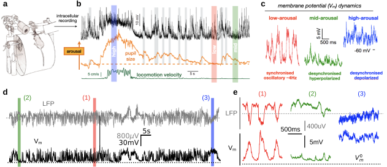
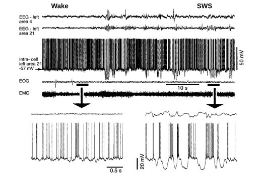

# Dynamical Regimes of Cortical Activity during Wakefulness

%%beginFigure%%
   
**| Diversity of cortical states across arousal levels during wakefulness.**
**(a)** Experimental setup to combine electrophysiological recording and monitoring of behavioural states in awake mice.
**(b)** Example epoch showing transitions between high, low and mid-arousal levels (red, blue and green respectively).
**(c)** Zoom over the $V_m$ dynamics from the coloured samples highlighted in **b** (N.B. we excluded the microdilation epoch for simplicity).
**(d)** Sample of our recordings in the somatosensory cortex in awake mice.
**(e)** Zoom over some samples.
Panels **a-c** are adapted from [McGinley et al., 2015a](McGinley2015a.pdf), [2015b](McGinley2015b.pdf). Panels **d-e** are adapted from [Zerlaut et al., 2022](Zerlaut2022.pdf).
%%endFigure%%

After defending my PhD in 2016, I joined the laboratory of Tommaso Fellin and Stefano Panzeri. 
My initial project focused on implementing a closed-loop system coupling optogenetic stimulation to slow oscillatory dynamics to analyse precisely the mechanisms of Up and Down states initiation and termination (unpublished, the added value with respect to the lab's original study, see [Zucca et al., 2017](Zucca2017.pdf), was rather minor).
I had the chance to be paired with Stefano Zucca for this project. 
I would set up the system and he would do the experimental recordings.
During the period when we were working on this together, Stefano Zucca was also performing recordings in *awake* mice for the revision of his paper [Zucca et al., 2017](Zucca2017.pdf). 
He had already pointed me to a study by [McGinley and colleagues (2015a)](McGinley2015a.pdf) that highlighted the rich dynamics unfolding across states of wakefulness in the rodent sensory cortex ([Fig.a-c](../Figures/McGinley-2015.svg), see also [Poulet & Petersen, 2008](Poulet2008.pdf); [Niell & Stryker, 2010](Niell2010.pdf) for previous reports).
I was very interested in seeing this live, so I spent some time sitting next to him during his recordings.

%%beginFigure%%
   
**| Classical view on cortical states. Wakefulness (*Wake*) is a fully-desynchronised state with narrow-variance depolarised membrane potential fluctuations. Slow Wave Sleep (SWS) is a state of synchronous transitions between a quiet Down state and an active Up state at $\sim$ 1Hz frequency.**
From top to bottom: electroencephalogram (EEG) from a distant area (area 4) and from the vicinity of the intracellular recordings (area 21, an associative sensory area), membrane potential of a regular spiking (RS) neuron from the left area 21, electro-oculogram (EOG) and electro-myogram (EMG).   
Reproduced from [Steriade et al., 2001a](Steriade2001a.pdf).
%%endFigure%%

Looking at membrane potential fluctuations in awake mice significantly challenged my view of cortical dynamics at the time. 
Having done the PhD under the supervision of Alain Destexhe (previously at *Laval University*, before joining the *CNRS*), I was strongly influenced by the work of Mircea Steriade and colleagues in cats (Diego Contreras, Igor Timofeev, Denis Paré, ...) and the view on cortical states that they derived from this experimental model ([Steriade et al., 1993](Steriade1993.pdf); [Steriade et al., 2001](Steriade2001a.pdf); [Steriade, 2001](Steriade2001b.pdf); see [Fig.](../Figures/Steriade-2001.svg)).

By simultaneously looking at the mouse and the membrane potential ($V_m$) on the oscilloscope, we could very clearly see that the $V_m$ state shifts were driven by behavioural transitions such as the onset of whisking periods or long periods of inactivity (although we did not have the camera monitoring behaviour and arousal in those sessions). 
Therefore, seeing such rich dynamics *within wakefulness* (and not a steady depolarisation with narrow variance fluctuations as shown in [Fig.](../Figures/Steriade-2001.svg)) was particularly striking (see [McGinley and colleagues (2015b)](McGinley2015b.pdf) for a perspective emphasising the unexpected nature of those observations). Additionally, intracellular recordings in the visual cortex of awake monkeys pointed to such a variability of states during wakefulness ([Tan et al., 2014](Tan2014.pdf)), thus convincing me of the potential generality of this phenomenon in the mammalian cortex.

From that point, the study of those activity regimes, in terms of underlying dynamics and electrophysiological signatures, became the main focus of my postdoctoral work at the *Italian Institute of Technology*.

### Network dynamics underlying the diversity of dynamical regimes during wakefulness

In my initial modelling work, I focused on the non-rhythmic states observed during wakefulness. This means excluding the periods of low frequency rhythms observed at low arousal levels ([Crochet and Petersen, 2006](Crochet2006.pdf); [Poulet & Petersen, 2008](Poulet2008.pdf), [Bennett et al., 2013](Bennett2013.pdf); [Polack et al., 2013](Polack2013.pdf); [Schneider et al., 2014](Schneider2014.pdf); [Zhou et al., 2014](Zhou2014.pdf); [Reimer et al., 2014](Reimer2014.pdf); [McGinley et al., 2015](McGinley2015a.pdf); [Vinck et al., 2015](Vinck2015.pdf); that can also be stimulus-evoked in the visual cortex, see [Einstein et al., 2017](Einstein2017.pdf)). In such regimes, the firing of neurons is temporally irregular (i.e. the interspike intervals follow a near-Poisson random distribution) and spiking across the population is asynchronous (i.e. the spike times of different neurons are independent, unlike in an oscillatory pattern where they tend to be phase-locked).

%%beginFigure%%
   
**| An overview of some influential models of balanced recurrent dynamics in neural networks.**  
**(a)** Irregular spiking activity emerges from a balanced network of binary units.
Adapted from [van Vreeswijk & Sompolinsky (1996)](VanVreeswijk1996.pdf).
**(b)** Asynchronous Irregular (AI) activity in a balanced network of integrate-and-fire units.
Adapted from [Amit & Brunel (1997b)](Amit1997b.pdf).
**(c)** Near-instantaneous excitatory-inhibitory balance in densely-connected recurrent networks.
Adapted from [Renart et al. (2010)](Renart2010.pdf).
**(d)** Emergence of slow time scales in recurrent networks with clustered-connectivity.   
Adapted from [Litwin-Kumar & Doiron (2012)](LitwinKumar2012.pdf).
%%endFigure%%

The notion that cortical spiking activity can be both highly irregular at the single-cell level and asynchronous at the population level has a rich theoretical history. 
I show in [Fig.](./Figures/classical-balanced-state.svg) some of the most influential studies investigating this phenomenon with increasing biological realism.
The foundational result was established by [van Vreeswijk and Sompolinsky (1996)](VanVreeswijk1996.pdf), who showed, in a network of simplified binary units, that a balance between strong recurrent excitation and strong recurrent inhibition naturally gives rise to a dynamical regime in which individual units fire highly irregularly, despite receiving large, strongly correlated excitatory and inhibitory drive ([Fig.a](./Figures/classical-balanced-state.svg)). Crucially, this irregularity was shown to be an intrinsic, self-organised property of the balanced architecture itself, rather than a consequence of noisy or unreliable individual units. The network's own recurrent dynamics amplify small fluctuations in the difference between excitation and inhibition into an irregular, effectively stochastic pattern of firing.
This idea was then extended to a more biologically grounded setting by [Amit & Brunel (1997)](Amit1997.pdf), who translated the balanced-network framework from binary units to networks of integrate-and-fire neurons ([Fig.b](./Figures/classical-balanced-state.svg)). This was even further characterised by [Brunel (2000)](Brunel2000.pdf), who provided a systematic analytical characterisation of this asynchronous irregular (AI) regime, mapping out the conditions on connectivity and synaptic strength under which sparsely connected excitatory-inhibitory spiking networks settle into this state, and distinguishing it from other possible dynamical regimes (synchronous, oscillatory, or quiescent).
An important generalisation came from [Renart & colleagues (2010)](Renart2010.pdf), who showed that this same asynchronous state is not restricted to the sparsely connected networks originally considered in the balanced-network framework, but persists even in densely connected networks, provided recurrent excitation and inhibition remain dynamically balanced ([Fig.c](./Figures/classical-balanced-state.svg)).
This result substantially broadened the applicability of the balanced-network framework, bringing it closer to the dense recurrent connectivity actually observed in cortical circuits.
As a further extension, [Litwin-Kumar & Doiron (2012)](LitwinKumar2012.pdf) revealed that this picture can be further enriched when a more realistic connectivity structure is considered ([Fig.d](./Figures/classical-balanced-state.svg)). 
Introducing even modest clustering of excitatory connections (i.e. grouping neurons into more strongly interconnected subpopulations, consistent with anatomical observations of cortical wiring) into an otherwise balanced network, they showed that this architectural change is sufficient to generate an entirely new dynamical phenomenon: slow, spontaneous fluctuations in firing rate across clusters, superimposed on the fast, irregular spiking of individual neurons. 
Overall, from the discovery that balanced excitation and inhibition alone can generate asynchronous irregular spiking ([van Vreeswijk and Sompolinsky, 1996](VanVreeswijk1996.pdf)), through its formalisation in more realistic spiking neuron models ([Amit & Brunel, 1997](Amit1997.pdf); [Brunel, 2000](Brunel2000.pdf)) and their extension to more realistic connectivity profiles with even richer emergent dynamical properties ([Renart et al., 2010](Renart2010.pdf); [Litwin-Kumar & Doiron, 2012](LitwinKumar2012.pdf), etc... see [Sadeh & Clopath, 2020](Sadeh2020.pdf) for a review on extended approaches), those studies have established balanced excitatory-inhibitory dynamics as a core principle of cortical activity.

However, I was finding that the dynamical picture provided by those models was difficult to reconcile with the specific membrane potential signature observed across states of wakefulness in the mouse sensory cortex ([Fig.](../Figures/intra-in-vivo.svg), [Fig.](../Figures/McGinley-2015.svg)).
Notably, those models all have in common the following properties: (1) they rely on strong levels of synaptic activity that produce large average excitatory and inhibitory synaptic currents cancelling close to spiking threshold ([Fig.d](./Figures/classical-balanced-state.svg)), (2) they rely on Gaussian $V_m$ fluctuations, and (3) they were investigated in rather high regimes of population firing rates.
Those models suited the observations in the awake cat cortex well ([Fig.](../Figures/Steriade-2001.svg)) or periods of active behaviour (blue periods in [Fig.c,e](../Figures/McGinley-2015.svg)), but would fail to describe the whole range of activity regimes observed in our preparation.
Indeed, in extended periods of our recordings ([Fig.](../Figures/intra-in-vivo.svg), [Fig.](../Figures/McGinley-2015.svg)), I had the impression that activity was extremely sparse, with, at times, only a few visible synaptic events shaping the $V_m$ fluctuations, thus resulting in strongly skewed $V_m$ fluctuations. The firing rate of our layer 2/3 pyramidal neurons was also surprisingly low, with average values in the range of 0.01-1 Hz.

I was therefore looking for a minimal network model able to generate this diversity of AI network states observed in the mouse sensory cortex. My initial guess was that such regimes would appear at very low rates of population activity. I therefore focused my investigation on emergent dynamical regimes at very low spiking levels. 
The results of this study were published in [Zerlaut et al., 2019](Zerlaut2019.pdf) and are included in *Part \ref{part:publis}* as *Selected Publication \ref{sec:Zerlaut2019} *.

Briefly, we demonstrated that randomly connected spiking networks with moderate recurrence strength exhibit a spectrum of asynchronous states, from afferent-dominated regimes (AD regimes, characterised by sparse activity) to recurrent-dominated regimes (RD regimes, characterised by dense activity and balanced synaptic currents). 
This therefore demonstrated that stable asynchronous activity *exists beyond the classical setting* of large and balanced excitatory and inhibitory currents.
This theoretical picture predicted a set of specific neurophysiological signatures for the different network states that were all confirmed by intracellular recordings in the mouse sensory cortex. In addition, a theoretical analysis revealed the computational specificity of each regime. The AD regime is optimal for the encoding of complex synaptic patterns while the RD regime confers a high sensitivity to incoming inputs. 
Importantly, those results _could provide the theoretical foundations to understand the link between the dynamics and function of cortical networks during wakefulness_ (see research project).

### Identifying fine-grained cortical states of wakefulness from Local Field Potential signals 

The literature characterising the specific cortical sub-states of wakefulness ([Fig.](../Figures/McGinley-2015.svg)) has emerged largely thanks to the precise readout of cortical dynamics afforded by intracellular recordings ([Petersen, 2017](Petersen2017.pdf)).
This can be explained by the exceptionally high signal-to-noise ratio such recordings provide: (1) a single pyramidal neuron samples a large fraction of its surrounding neuronal population through its 1,000–10,000 synapses, and (2) the resulting synaptically driven membrane potential fluctuations far exceed the sub-millivolt noise level of patch-clamp recordings.
These recordings, however, are technically demanding and low-throughput, making them poorly suited to the large-scale, chronic, or population-level recordings increasingly used to study behaviour.
I therefore sought a way to characterise the same cortical sub-states of wakefulness from the far more accessible local field potential (LFP) signal.

Existing methods for classifying cortical network states from the local field potential (LFP) were largely restricted to identifying rhythmic states (i.e. periods of synchronised, oscillatory activity typically detected via elevated power in specific low-frequency bands of the raw LFP signal).  
To design a method capable of resolving this continuum from extracellular signals alone, I took inspiration from earlier work in anaesthetised cats, which showed that the power of the LFP in the high-gamma range is tightly linked to the depolarisation level of local neurons during slow-wave sleep ([Mukovski et al., 2006](Mukovski2006.pdf)). 
Building on this principle, I developed a method to classify cortical network states directly from LFP recordings in the awake mouse neocortex, and validated it in two complementary datasets: (1) our own joint intracellular and extracellular recordings in mouse sensory cortex, which provided direct, ground-truth access to the membrane potential dynamics the method aims to infer from the LFP alone, and (2) Neuropixels recordings from the Allen Institute's Visual Coding dataset, in mouse visual cortex during behaviour, which allowed us to test the method's generalisation to a large-scale, independently collected dataset. 
In both cases, the method successfully recovered a continuous classification of network states, consistent with the graded, U-shaped model of arousal and cortical state proposed by [McGinley and colleagues (2015)](McGinley2015b.pdf), thereby making the fine-grained characterisation of cortical state, previously accessible only through intracellular recordings, available directly from extracellular LFP or Neuropixels recordings.

This work was published in [Zerlaut et al., 2022](Zerlaut2022.pdf) and is included in *Part \ref{part:publis}* as *Selected Publication \ref{sec:Zerlaut2022}*.  

