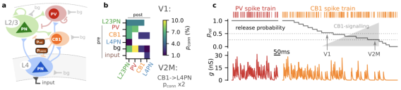

# Cortical Circuits of State-Dependent Processing

For my second postdoctoral position, I joined the laboratories of Nelson Rebola and Alberto Bacci in 2020, on a joint project spanning both groups. My motivation was to develop expertise in interneuronal populations, which appeared to play a critical role in the genesis and maintenance of cortical states. 

Indeed, the dynamical reorganisation associated with arousal/behavioural state transitions is thought to be implemented locally, through the specific recruitment of distinct interneuron subtypes. 
This is made possible through the striking diversity of cortical GABAergic interneurons in connectivity, physiology, and molecular identity ([Tremblay et al., 2016](Tremblay2016.pdf); [Kepecs & Fishell, 2014](Kepecs2014.pdf)). 
In particular, a disinhibitory motif linking VIP, SST, and PV interneurons has emerged as a canonical circuit mechanism by which neuromodulatory and state-related signals reshape local network gain ([Kepecs & Fishell, 2014](Kepecs2014.pdf); [Ferguson & Cardin, 2020](Ferguson2020.pdf)), a principle that extends more broadly to how ascending neuromodulatory systems shape cortical dynamics and behaviour ([McCormick et al., 2020](McCormick2020.pdf)).
This literature motivated one of the central questions of my research: how does state-dependent, largely interneuron-mediated modulation of local network activity give rise to changes in the computations performed by cortical circuits? To address this question, my work in those laboratories combined theoretical modelling with experimental recordings, notably two-photon imaging in behaving mice.

Beyond the knowledge I gained, this position also served as a preparatory step toward building my independent research line, notably in establishing the core of my experimental approach.

I worked on three different projects. In the following sections, I describe the two that were published ([Koukouli et al., 2022](Koukouli2022.pdf); [De Brito Van Velze et al., 2024](VanVelze2024.pdf)). The last one is still an ongoing project and is described in *section 4* of my *Research Projects* (Part \ref{part:projects}).

### Role of CB1+ basket cells

%%beginFigure%%
   
**| A model for endocannabinoid modulation in cortical circuits.**
**(a)** Schematic of the cortical circuit model including layer 4 (L4) and layer 2/3 (L2/3) with PV+ and CB1+ inhibitory populations.
**(b)** Connectivity matrix of the populations in the model. Note the increased probability between CB1+ cells and L4 pyramidal neurons (PNs) in V2. 
**(c)** Illustration of the different settings of the release probability at inhibitory synapses in the model. The PV+ population has a high release probability $p_{rel}$=1, thus leading to a dense synaptic activity (see conductance traces at the bottom). On the other hand, CB1+ cells have a lower release probability, $p_{rel}$=0.5 in V1 and $p_{rel}$=0.25 in V2M, thus leading to very sparse inhibitory post-synaptic activity.
%%endFigure%%

Perisomatic inhibition of cortical pyramidal neurons is provided by two largely non-overlapping classes of basket cells that differ in developmental origin, molecular identity, and synaptic dynamics ([Freund & Katona, 2007](Freund2007.pdf)). 
Parvalbumin-positive (PV+) basket cells, derived from the medial ganglionic eminence, form fast and highly reliable GABAergic synapses onto the soma and proximal dendrites of pyramidal neurons. 
A second population, derived from the caudal ganglionic eminence and overlapping substantially with the classically defined cholecystokinin (CCK)-expressing basket cells,
innervates the same perisomatic compartment but produces synapses with markedly different properties: low release probability, high failure rates, and pronounced short-term depression. 
The defining feature of this second population is the presence of the type-1 cannabinoid receptor (CB1) on its axon terminals, placing GABA release from these cells under the control of endocannabinoid signalling. 
Endocannabinoids are synthesised postsynaptically in an activity-dependent manner and act retrogradely on presynaptic CB1 receptors to transiently suppress GABA release. This phenomenon was first described as depolarisation-induced suppression of inhibition, or DSI ([Wilson & Nicoll, 2001](Wilson2001.pdf)).  

Beyond this phasic, activity-triggered suppression, CB1 signalling at CCK+ basket cell synapses also exerts a tonic, standing inhibitory tone on GABA release that persists in the absence of any discrete depolarising trigger ([Neu et al., 2006](Neu2006.pdf)), indicating that the strength of these synapses is set not by a fixed synaptic weight but by a continuously adjustable endocannabinoid brake.

%%beginFigure%%
   
**| Modelling the effect of the visual-area-specific CB1 modulation properties on the dynamics of cortical circuits**.
**(A–C)** Schematic of the network models for the L4-L2/3 circuits in the V1 (A), V2M (B), and V2M-CB1-KO (C).
**(D)** Single realisations of the network simulations. Shown is spike raster activity of CB1 (orange), PV (purple) BCs, L2/3 PNs (green), and L4 PNs (blue) at two different time scales. Example Vm traces and the time-varying rates for each neuronal population are shown. Spiking events are truncated for display. Input to L4 is shown at the top (brown). V1, left; V2M, centre; V2M-CB1-KO, right.
**(E)** Spontaneous firing rates as a function of release probability in the three cases.
**(F)** Spontaneous activity rates of L2/3 PNs in the 3 cases of (A)–(C).
**(G)** Mean depolarisation of L4 PNs during spontaneous activity in the 3 cases of (A)–(C).
**(H)** L4 input to L2/3 output curves in the 3 cases of (A)–(C).
**(I)** Gain of the spontaneous activity levels in the 3 cases shown in (A)–(C). This quantity reflects the ratio of evoked and spontaneous activity in the network.
**(J)** 300-ms STTC for the simulation shown in (A)–(C).
%%endFigure%%

This tonic component raises a question: is the level of this standing endocannabinoid brake a fixed property of CB1 basket cell synapses, or can it be tuned differently across cortical circuits, with consequences for how the pyramidal neurons downstream behave? 
This is the question that was addressed by the team led by Joana Lourenço and Alberto Bacci. 
They investigated CB1 modulation by comparing primary (V1) and secondary visual cortex (V2M), and found that the strength of tonic CB1 signalling (i.e. the reliability of GABA release from these basket cells) differs markedly between the two areas, with weaker, less reliable inhibition in the secondary area. 
When measuring the effect of CB1 *in vivo*, they found that tonic CB1 signalling was responsible for higher but less coordinated PN activity in V2M than in V1.
This last observation is *a priori* counter-intuitive because the level of correlation is expected to increase with firing rates ([De la Rocha et al., 2007](DelaRocha2007.pdf); [Renart et al., 2010](Renart2010.pdf)). 

We therefore turned to theoretical modelling to analyse this counter-intuitive phenomenon.
My contribution was to derive and implement a theoretical model for this atypical inhibitory circuit motif. I incorporated the CB1+ modulation effect in cortical circuits ([Fig.](../Figures/cb1-model.svg)) by adapting a previous model of sensory cortex dynamics ([Zerlaut et al., 2019](Zerlaut2019.pdf)).
I next performed the network simulations to analyse the emergent dynamics introduced by this specific circuit and its modulatory action on network function ([Fig.](../Figures/cb1-ntwk.svg), considering network dynamics both during spontaneous activity and in response to an external stimulus).
We found that the model predicted that the combination of decreased probability of GABA release from CB1 BCs in V2M and their inhibitory feedback loop to L4 PNs could account for the counter-intuitive reduction of L2/3 PN coordination in a higher-frequency firing regime ([Fig.](../Figures/cb1-ntwk.svg)), thus offering a potential theoretical explanation for their experimental observation. Those results were published in [Koukouli et al., 2022](Koukouli2022.pdf).

### Disinhibitory circuit across sensory modalities

Among cortical interneurons, somatostatin-positive (SST+) cells are distinguished by their preferential innervation of pyramidal neuron dendrites, where they regulate the integration of synaptic inputs by shaping how sensory information is processed rather than simply gating whether it reaches the soma. 
SST interneuron (SST-IN) activity is itself under tight control by a second interneuron class, the vasoactive intestinal peptide-expressing (VIP+) interneurons, which form inhibitory synapses onto SST-INs and are recruited by behaviourally relevant, often neuromodulatory, signals associated with arousal and movement. This VIP-to-SST disinhibitory motif (in which VIP-IN activation suppresses SST-IN output and thereby releases pyramidal neurons from dendritic inhibition) has become a canonical mechanism for behavioural-state-dependent gain control in cortex ([Pi et al., 2013](Pi2013.pdf); [Fu et al., 2014](Fu2014.pdf)). 
However, this motif was largely established within single sensory areas and under specific stimulus conditions, leaving open whether SST-IN engagement during state transitions such as locomotion is governed uniformly by VIP-mediated disinhibition across cortex, or whether other pathways also contribute to setting SST-IN activity during active states.

In our study, we addressed this question by comparing SST-IN recruitment by locomotion across the primary somatosensory (S1) and visual (V1) cortices of the mouse. We found that locomotion strongly recruited SST-INs in S1 but had little effect on SST-INs in V1 when animals were kept in darkness. This discrepancy could not be explained by differences in VIP-IN engagement between the two areas, arguing against a purely disinhibition-based account. This area-specific effect disappeared once visual input was provided, and pharmacological inactivation of the somatosensory thalamus, but not chemogenetic suppression of VIP-IN activity, substantially reduced the modulation of SST-INs by locomotion. This therefore implicated feedforward, sensory-driven thalamocortical transmission, rather than VIP-mediated disinhibition, as the dominant route by which SST-INs are recruited during active states. 
I designed a spiking network model, incorporating both pathways, which showed that the observed pattern of SST-IN modulation across areas and conditions could be reproduced simply by varying the relative weight of VIP-driven inhibition versus thalamus-driven excitatory drive onto the local circuit.
This indicated that SST-IN engagement during behavioural state transitions reflects the balance between these two, functionally opposing, control pathways rather than the action of either one alone. 
Taken together, our study reframes SST-INs not simply as a target of neuromodulatory disinhibition, but as an integration point where feedforward sensory information and internal, arousal-linked signals are combined to adapt cortical processing to the current behavioural state.

This work was published in [De Brito Van Velze et al., 2024](VanVelze2024.pdf) and is included in *Part \ref{part:publis}* as *Selected Publication \ref{sec:VanVelze2024}*.

