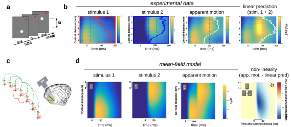

# Mesoscopic Integration in the Cerebral Cortex

The approaches described in the previous parts focus on neural dynamics at the scale of single neurons and local neural networks.
A natural question is then how the dynamics at such scales impact the dynamics at larger scales: at the mesoscopic scale (i.e. the $\sim$ 1 cm scale, the assembly of several local columnar cortical modules, e.g. the full visual cortex) and at the whole-brain level.

Understanding how microscopic mechanisms translate into the large-scale dynamics measured experimentally requires an additional step of integration: relating the properties of individual cells and synapses to the collective dynamics of the neural populations they form.
To this end, one can use the so-called *mean-field description* of cortical dynamics, a framework directly inspired by techniques developed in statistical physics to derive the macroscopic behaviour of systems composed of very large numbers of interacting microscopic units ([Amit & Brunel, 1997](Amit1997.pdf); [Brunel, 2000](Brunel2000.pdf); [El Boustani & Destexhe, 2009](ElBoustani2009.pdf); [Montbrío et al., 2015](Montbrio2015.pdf)).
Rather than tracking the activity of each neuron individually, this approach derives equations governing the evolution of population-averaged quantities (e.g. the mean firing rate of a neural population) directly from the biophysical properties of its constituent neurons and synapses.
The central appeal of this approach is that it preserves an explicit link between the microscopic and macroscopic levels of description: because the mean-field equations are derived from the biophysical properties of single cells and synapses, they make it possible to relate specific microscopic features (i.e. receptor and channel properties, synaptic weights, or the connectivity structure of a local circuit) to the macroscopic dynamical properties that emerge at the network level.
This stands in contrast to purely phenomenological population models, whose parameters only carry indirect biophysical interpretations ([Wilson & Cowan, 1972](Wilson1972.pdf); [Freeman, 1975](Freeman1975.pdf); [Jansen & Rit, 1995](Jansen1995.pdf); [Freeman, 2000](Freeman2000.pdf); [David & Friston, 2003](David2003.pdf); [Coombes, 2010](Coombes2010.pdf)).
This property makes mean-field approaches particularly well suited to bridging cellular and circuit-level neuroscience with the macroscopic imaging techniques that dominate systems and cognitive neuroscience (see [Destexhe, 2026](Destexhe2026.pdf) for a review). 
Signals such as voltage-sensitive dye (VSD) wide-field imaging, EEG, and fMRI are, by construction, mesoscopic or macroscopic measurements, reflecting the aggregate activity of large neuronal populations rather than that of individual cells.
Mean-field models, precisely because they are formulated at this same population level while remaining grounded in cellular biophysics, offer a natural and quantitative framework for interpreting such macroscopic signals in terms of the underlying microscopic circuit properties ([Deco et al., 2008](Deco2008.pdf); [Breakspear, 2017](Breakspear2017.pdf); [Destexhe, 2026](Destexhe2026.pdf)).

Bringing biophysical realism and microscopic properties into large-scale descriptions of neural activity is a long-term research goal of Alain Destexhe, my PhD supervisor. I personally contributed to the design and implementation of this theoretical formalism, and present our joint work on this topic in this section.

### Establishing a general framework for population dynamics incorporating *ad-hoc* transfer functions

When I started the PhD, the laboratory had developed a master equation formalism 
for neural dynamics under regimes of asynchronous irregular activity ([El Boustani & Destexhe, 2009](ElBoustani2009.pdf), i.e. the regime characterising activity in the awake brain).
This formalism describes the joint evolution of population-level quantities (the mean firing rate of each neural population, together with its variance and the covariances between populations) as a set of coupled differential equations, derived under the assumption that population activity can be treated as a continuous-time Markov process (at a time scale of $\sim$ 5ms).
Within this framework, the transition rates driving the evolution of these macroscopic quantities are entirely determined by the transfer function of each population: the function giving a neuron's output firing rate as a function of the statistics (mean, variance, correlation time) of its synaptic input. 
In this sense, the transfer function constitutes the single microscopic ingredient that the Markovian formalism requires in order to predict macroscopic network dynamics.

For simplified neuron models, such as the leaky integrate-and-fire neuron receiving current-based synaptic input, this transfer function can be derived analytically, typically through a Fokker-Planck treatment of the associated diffusion process ([Brunel & Hakim, 1999](Brunel1999.pdf); [Amit & Brunel, 1997](Amit1997.pdf)). 
However, this analytical tractability is lost as soon as more biophysically realistic ingredients are introduced: conductance-based synaptic interactions, spike-frequency adaptation, and the nonlinear spike-generating mechanism of the adaptive exponential integrate-and-fire (AdEx) model all preclude a closed-form solution for the transfer function. 
To circumvent this limitation, we had introduced a semi-analytical approach ([Zerlaut et al., 2016](Zerlaut2016.pdf)): rather than deriving the transfer function from first principles, we adopted a fixed functional template (a second-order polynomial expansion of the firing rate in terms of the mean, standard deviation, and correlation time of the input) and fitted its free parameters numerically, by simulating the single-cell model's response to a broad set of stationary synaptic input statistics.

In a following study ([Zerlaut et al., 2018](Zerlaut2018.pdf)), we assessed the validity of this combined approach (the Markovian mean-field formalism together with the semi-analytical transfer functions) as a predictive model of network dynamics, by systematically comparing its predictions against direct numerical simulations of the underlying spiking network. 
Beyond validating the model's steady-state predictions, we specifically tested its ability to capture the network's transient, time-varying responses.
This was a substantially stronger test, since the mean-field derivation relies on a quasi-stationary approximation of the transfer function that is, a priori, expected to break down as input statistics vary too rapidly for the population to be treated as being in local equilibrium.
Contrary to this expectation, we found the mean-field model to remain in remarkably good agreement with the spiking network simulations up to surprisingly fast timescales, accurately capturing response transients as fast as ~20 ms (i.e., frequencies up to ~50 Hz), well beyond the slow, quasi-stationary regime the approach was originally expected to be restricted to.

This study is included as *Selected Publication \ref{sec:Zerlaut2018}*.

### Modelling of the "apparent motion" illusion in the visual cortex  

The perception of motion from a sequence of discrete, non-moving stimuli, known as *apparent motion*, is one of the oldest and most robust phenomena in visual perception. First described by [Wertheimer (1912)](Wertheimer1912.pdf) in the founding work of Gestalt psychology, apparent motion arises when two stimuli are flashed in close spatial and temporal proximity ([Fig.a](./Figures/Chemla-2019.svg)): rather than perceiving two separate, static events, observers report a single, smoothly moving stimulus travelling from the first location to the second. 
This illusion is an important feature of our vision; for example, it is the basic perceptual principle underlying the impression of continuous motion in film and animation.
The neural basis of this phenomenon is, however, still only partially understood, specifically: what cortical mechanism transforms two spatially and temporally discrete inputs into a percept of motion for a single object?

Key insights came from voltage-sensitive dye (VSD) imaging studies, which offered access to population-level cortical dynamics that single-unit recordings had failed to resolve (no single-neuron correlate of long-range apparent motion having been convincingly identified).
Using VSD imaging in cat visual cortex, [Jancke and colleagues (2004)](Jancke2004.pdf) showed that a spatially localised, non-moving flash evokes a wave of cortical activity that spreads continuously across the retinotopic map, and that the spatiotemporal profile of this wave closely matches the trajectory and timing of the perceived illusory motion. 
This travelling-wave signature was later confirmed for genuine long-range apparent-motion sequences in ferret visual cortex ([Ahmed et al., 2008](Ahmed2008.pdf)). 
Mechanistically, such waves are thought to be supported by the dense network of horizontal, long-range intracortical connections known to mediate the lateral propagation of visual activity within area V1 ([Bringuier et al., 1999](Bringuier1999.pdf)).

Together, these studies suggested that apparent motion might not require an explicit, dedicated "motion detector," but could instead emerge from the passive spread of activity through recurrent cortical circuitry. 
However, this passive spread of activity might lead to distorted cortical representations of single objects when presented sequentially in time and space. Therefore, how is single object representation maintained in such a case?
In two companion papers with the team of Frédéric Chavane (*Aix-Marseille University*), we addressed this question by combining experimental characterisation in monkey visual cortex with network dynamics modelling.

In the first study ([Zerlaut et al., 2018](Zerlaut2018.pdf)), we derived a model of cortical dynamics at the scale of a large retinotopic area in the visual cortex ($\sim$ 10 mm, [Fig.c](../Figures/Chemla-2019.svg)) using the above-mentioned mean-field approach. 
This model reproduces the essential ingredient identified by the earlier VSD studies: it exhibits waves of stimulus-evoked activity that propagate laterally across the modelled cortical surface, at a speed and with a spatial profile that I calibrated directly against VSD imaging measurements in monkey visual cortex.

%%beginFigure%%
   
**| A suppressive interaction helps to maintain object representation constant during the apparent motion illusion**.   
**(a)** Schematic of the apparent motion (AM) protocol. Two single dots are presented sequentially close in time and space thus giving the illusion of a moving dot. They are also presented alone ("stimulus 1" / "stimulus 2") to evaluate the expected linear response of the visual cortex. 
**(b)** Voltage-Sensitive Dye imaging (VSDi) in the monkey visual cortex in response to stimulus 1 alone, stimulus 2 alone, to the AM sequence and to the linear predictions computed from the responses to stimulus 1 & 2 alone.
**(c)** Schematic of the mean-field model of the visual cortex distributed on the cortical trajectory of the stimulus. 
**(d)** Relative membrane polarisation levels of neurons in the mean-field model ($\delta_{V_m}$/$V_m$, i.e. analogous to VSDi signals, see [Chemla & Chavane, 2010](Chemla2010.pdf)) in response to stimulus 1 alone, stimulus 2 alone and to the AM sequence. The last panel shows the non-linearity computed as the difference between the AM response and the linear predictions computed from the responses to stimulus 1 & 2 alone. Note the strongly suppressive interaction that seems to travel from stimulus 2 back to stimulus 1.  
Adapted from [Chemla et al., 2019](Chemla2019.pdf).
%%endFigure%%

Building on this model, the second study ([Chemla et al., 2019](Chemla2019.pdf)) uncovered a further, unanticipated property: when two stimuli are presented, the model predicted a suppression of the evoked response ([Fig.d](./Figures/Chemla-2019.svg)), arising directly from the sublinear nature of synaptic integration within the network (mostly mediated by *shunting* conductance-based interaction, see [Hô and Destexhe, 2000](Ho2000.pdf); [Chance et al., 2002](Chance2002.pdf) for the associated effect at the single cell level).

Such a non-linear suppressive interaction was found to be a prominent feature of the apparent motion response in the monkey visual cortex ([Fig.b](./Figures/Chemla-2019.svg)).
The comparison with the linear prediction response highlights an important consequence of lateral propagation: the lateral spread of excitatory activity would strongly distort the cortical representation of a single dot (note the wider and much higher levels after stimulus 2 than after stimulus 1 in [Fig.b](./Figures/Chemla-2019.svg)). However, the suppressive interaction makes it possible to (1) strongly reduce the activity related to stimulus 2, making it resemble stimulus 1, and (2), through the backpropagation of the suppression, strongly reduce the long-lasting component of stimulus 1, in order to disambiguate the stimulus position on the apparent motion track.
Therefore, we conclude that this suppression makes it possible to maintain a near-identical representation of the single object (the dot) during its apparent motion ([Chemla et al., 2019](Chemla2019.pdf)).

Taken together, these two studies provide a mechanistic, biophysically grounded account of the *stability of object representation* during the apparent-motion illusion in terms of the basic integrative properties of recurrent cortical networks.

### Generalisation to other brain structures

The mean-field framework presented above was developed and validated specifically for cortical circuits, built around the canonical excitatory (regular-spiking) and inhibitory (fast-spiking) population motif that characterises neocortical microcircuitry. 
A natural question is whether this same strategy (deriving population-level transfer functions directly from the biophysical properties of a circuit's constituent cell types) generalises to brain structures whose microarchitecture departs substantially from this cortical template.

We addressed this question directly in a collaborative study extending the mean-field approach to the cerebellum ([Lorenzi et al., 2023](Lorenzi2023.pdf)). 
The cerebellar microcircuit offers a particularly stringent test case: rather than a single excitatory-inhibitory pair, it comprises several molecularly and functionally distinct populations (granule cells, Golgi cells, molecular layer interneurons, and Purkinje cells) arranged in a stereotyped, well-characterised architecture that differs fundamentally from the recurrent excitatory-inhibitory loops of neocortex.
We derived a multi-layer mean-field model explicitly embedding this population-specific microstructure, deriving a transfer function for each cerebellar cell type from its individual biophysical properties, in the same spirit as the cortical transfer functions described above. 
This mean-field model was validated against both an equivalent spiking neural network simulation of the same cerebellar microcircuit and experimental recordings, and was found to accurately reproduce the population-specific responses of each cell type to varying afferent (mossy fibre) input, capturing dynamics that emerge specifically from the cerebellum's distinctive connectivity pattern.

Beyond its specific application to the cerebellum, this work demonstrates that the transfer-function-based mean-field strategy is not a cortex-specific tool, but a general framework for linking microscopic circuit architecture to macroscopic, population-level dynamics. 
One that can, in principle, be adapted to any brain structure for which the relevant cell-type-specific biophysical and connectivity data are available.

