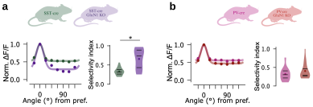
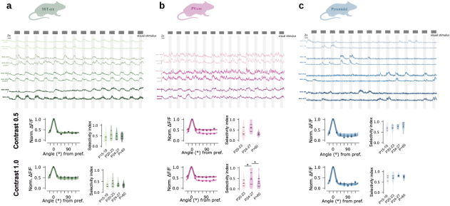

# Mechanisms and Function of Inhibitory Specialisation

Cortical inhibition has sometimes been treated, at first approximation, as a single, generic counterweight signal to excitation that keeps network activity within a stable operating range. 
This view, however, is hard to reconcile with one of the most striking aspects of cortical circuits: GABAergic interneurons are not a homogeneous population, but a remarkably diverse one, differing in morphology, electrophysiological profile, connectivity, and molecular identity ([Markram et al., 2004](Markram2004.pdf); [Ascoli et al., 2008](Ascoli2008.pdf); [Tremblay et al., 2016](Tremblay2016.pdf)).
This diversity raises an immediate question: why would cortical circuits require so many distinct classes of inhibitory neuron, rather than a single, generic inhibitory mechanism?
An influential view is that this diversity reflects genuine functional specialisation: different interneuron types appear to be tailored to distinct computational roles within cortical circuits, rather than being interchangeable implementations of the same inhibitory function ([Kepecs & Fishell, 2014](Kepecs2014.pdf)). 
In particular, the strong involvement of interneurons in controlling transitions and maintenance of different activity regimes suggests a key role in shaping the state-dependent processing capabilities of the neocortex ([Zerlaut & Tzilivaki, 2025](Zerlaut2025.pdf)).

Beyond its role in healthy cortical computation, inhibitory dysfunction has been directly implicated in a range of psychiatric and neurological disorders, underscoring the clinical relevance of understanding interneuron diversity and specialisation. 
In schizophrenia, deficits specifically affecting parvalbumin-expressing interneurons have been repeatedly identified in postmortem tissue, and are thought to disrupt the precise temporal coordination of cortical activity these cells normally support ([Lewis et al., 2005](Lewis2005.pdf)). In autism spectrum disorders, an elevated ratio of excitation to inhibition (potentially reflecting altered interneuron number, connectivity, or function) has been proposed as a unifying circuit-level mechanism across otherwise heterogeneous genetic aetiologies ([Rubenstein & Merzenich, 2003](Rubenstein2003.pdf)). 
More broadly, excitation-inhibition imbalance has been put forward as a general organising framework for understanding the mechanistic basis of multiple neuropsychiatric conditions, cutting across traditional diagnostic categories ([Sohal & Rubenstein, 2019](Sohal2019.pdf)), while interneuron dysfunction specifically has been reviewed as a converging point across schizophrenia, autism, epilepsy, and anxiety disorders ([Marín, 2012](Marin2012.pdf)). Understanding the mechanisms and functional logic of inhibitory specialisation in the healthy cortex, as pursued in this section, is therefore not only a question of basic circuit function, but a necessary foundation for interpreting how and why this specialisation breaks down in disease.

Part of my future research will focus on addressing the mechanisms behind the different functional roles of cortical inhibition, in the healthy brain, as well as in disease models. I describe below some ongoing research projects on this topic.

### Cellular mechanisms controlling inhibitory specificity

%%beginFigure%%

**| Orientation tuning of interneurons (PV+ and SST+) under control and conditional knockout of the NMDA receptor.**
Note the important impact of NMDAR deletion strongly sharpening the tuning curve of SST-INs while it has a much more moderate impact on PV-INs.
Unpublished data from Martins Pinho, Zerlaut & Rebola.
%%endFigure%%

A substantial body of work has implicated NMDA receptor (NMDAR) signalling in parvalbumin-expressing (PV) interneurons as a key substrate of cortical GABAergic dysfunction, particularly in the context of the NMDAR-hypofunction theory of schizophrenia ([Lisman et al., 2008](Lisman2008.pdf)).
Genetic ablation of the obligatory GluN1 subunit specifically in PV interneurons has been shown to disrupt hippocampal synchrony, spatial representations, and working memory ([Korotkova et al., 2010](Korotkova2010.pdf)), while broader ablation of NMDARs in cortical and hippocampal interneurons produces a range of schizophrenia-like behavioural phenotypes ([Belforte et al., 2009](Belforte2009.pdf)). Critically, however, these effects appear to be developmentally restricted: [Belforte and colleagues (2009)](Belforte2009.pdf) explicitly showed that NMDAR deletion restricted to the postadolescent period failed to reproduce the phenotypes obtained when the same deletion occurred during early postnatal development, suggesting that the requirement for NMDAR signalling in PV interneurons may be largely confined to a developmental window rather than persisting into the mature circuit.

Consistent with this possibility, our own recent characterisation of dendritic integration in the adult neocortex ([Morabito, Zerlaut, et al., 2025](Morabito2025.pdf)) found only a minor functional contribution of NMDARs to PV interneuron responses, in marked contrast to a prominent, NMDAR-dependent supralinear integration mode specifically in SST interneurons. 
This raises an unresolved question directly relevant to the broader PV-NMDAR literature: does the established link between NMDAR signalling and PV interneuron function primarily reflect a developmental requirement, largely absent in the adult circuit, while NMDAR-dependent integration in the mature cortex is instead a defining, SST-specific property?

We now plan to address the functional contribution of NMDARs in PV versus SST interneuron responses more specifically by investigating their specific roles in local network computation.
A well-established example of such computation in the visual cortex is orientation tuning: unlike excitatory pyramidal neurons, which typically display sharp orientation selectivity, inhibitory interneurons (including both PV and SST subtypes) are characteristically broadly tuned, pooling input from neurons across a wide range of preferred orientations ([Kerlin et al., 2010](Kerlin2010.pdf)). This broad inhibitory tuning is thought to play an important role in shaping the sharp tuning of principal neurons themselves, for instance by providing a relatively orientation-invariant normalisation signal against which sharply tuned excitatory input is compared. 
In [Fig.](../Figures/IN-nmda.svg), I show preliminary data for the impact of NMDAR on orientation tuning in PV and SST interneurons, showing a strong impact on SST-INs and a more moderate impact on PV-INs. Ongoing work aims at investigating the impact on the pyramidal neurons they target, in order to determine whether NMDAR-dependent dendritic integration contributes causally to establishing or maintaining broad inhibitory tuning and, through it, the sharp tuning of principal cortical neurons.

### Functional maturation of inhibitory circuits

%%beginFigure%%

**| Orientation tuning of interneurons (PV+ and SST+) as well as pyramidal neurons across development.**
Top. Raw $\Delta$F/F traces of single cells recorded using 2-photon imaging at 3 developmental time points.
Bottom. Orientation tuning curves at half and full contrast in the three cell types.  
Unpublished data from Martins Pinho, Zerlaut & Rebola.
%%endFigure%%

Our recent work established that PV and SST interneurons in the mature neocortex rely on qualitatively distinct dendritic integration programmes ([Morabito, Zerlaut, et al., 2025](Morabito2025.pdf)): PV-INs show sublinear integration supported by proximally biased, NMDAR-poor synapses, tuned for the precise tracking of fast-changing input, while SST-INs show NMDAR-dependent supralinear integration with uniformly distributed synapses, tuned for broader temporal integration. This dichotomy, however, was characterised in the adult circuit, leaving open the question of how, and when, it emerges over development.

Interneuron maturation is known to be a protracted, circuit-specific process rather than a fixed developmental endpoint. 
PV interneurons in particular undergo a well-characterised functional maturation extending over several postnatal weeks, encompassing changes in intrinsic excitability, synapse kinetics, and connectivity, and this maturation is itself tightly coupled to sensory experience, forming the mechanistic basis of classical cortical critical periods ([Hensch, 2005](Hensch2005.pdf)). 
More broadly, distinct interneuron subtypes (generated at different embryonic time points and following distinct molecular programmes) mature along different trajectories and timescales, contributing to cortical circuit assembly in qualitatively different ways at different postnatal ages ([Le Magueresse & Monyer, 2013](LeMagueresse2013.pdf)). 
At the cellular level, this maturation includes a gradual, multi-week refinement of PV-interneuron synaptic and intrinsic properties specifically ([Okaty et al., 2009](Okaty2009.pdf)).

What remains unknown is whether the dendritic integration dichotomy we identified between PV and SST interneurons is itself a developmentally acquired specialisation, emerging gradually and potentially at different rates or developmental windows for each cell type, or whether it is present from the onset of synaptic connectivity. 
This question is particularly important given that PV and SST interneurons originate from overlapping progenitor domains but are known to follow distinct maturational schedules, raising the possibility that their adult dendritic specialisation is itself sculpted by an asynchronous developmental programme, potentially interacting with sensory-driven activity in a subtype-specific manner.

To directly address how dendritic integration properties emerge in each interneuron subtype, we now perform two-photon glutamate uncaging recordings across multiple postnatal developmental time points, in genetically identified PV and SST interneurons (see [Fig.](../Figures/IN-develop.svg)).
This will make it possible to track, for each cell type, how NMDAR-dependent integration and overall integration mode change over the course of development, and to determine whether the two subtypes acquire their distinct, mature integration programmes synchronously or along distinct developmental timelines.

